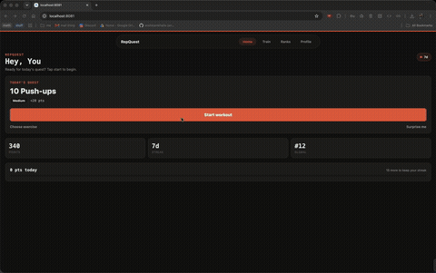
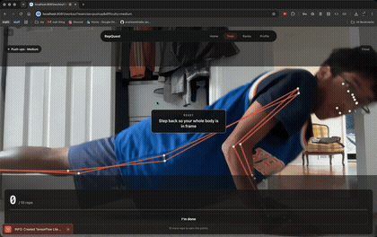
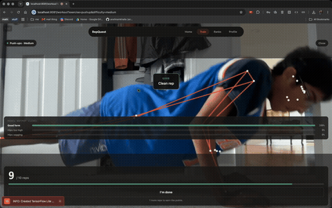

# RepQuest

RepQuest turns push-ups, squats, and lunges into daily quests: point your phone's camera at yourself, and an on-device pose-estimation pipeline counts your reps and grades your form in real time — no wearables, no manual logging.

<p align="center">
  
  
  
</p>

## How it works

1. **Today's quest** — the home screen hands you a quest (e.g. "10 Push-ups · Medium · +20 pts"). Difficulty auto-climbs from Easy → Medium → Hard as you bank more points, or you can pin a difficulty yourself.
2. **Start workout** — the camera opens and a pose model starts tracking your joints live.
3. **Live feedback** — every rep is counted by an angle-based state machine (elbow/hip/knee angles), and for push-ups and lunges a trained classifier additionally grades form per rep ("Clean rep", "Hips sagging — brace your core", "Keep your torso upright", ...).
4. **Quest complete** — hit your target and you bank the quest's points, extend your streak, and see your most common form issue from that set.

| Exercise | Easy | Medium | Hard | Form classifier |
|---|---|---|---|---|
| Push-ups | 5 reps · 10 pts | 10 reps · 20 pts | 20 reps · 30 pts | ✅ trained model |
| Squats | 10 reps · 10 pts | 15 reps · 20 pts | 20 reps · 30 pts | rep counting only |
| Lunges | 10 reps · 10 pts | 16 reps · 20 pts | 20 reps · 30 pts | ✅ trained model |

Streaks extend once you've banked 15+ points in a day (`STREAK_THRESHOLD`); difficulty auto-recommends Easy under 250 lifetime points, Medium under 800, Hard beyond that.

## Why it's interesting

Most "AI form checker" demos are a cloud API call per frame. RepQuest's entire inference pipeline — pose landmarks **and** the trained quality classifier — runs **on-device**, live, with no network round-trip:

- **Web** loads MediaPipe's `PoseLandmarker` (`@mediapipe/tasks-vision`) from a CDN and runs the same rep-counting state machine in the browser.
- **Native (iOS/Android)** runs the identical pose model (`pose_landmarker_full.task`) via `react-native-mediapipe`, and additionally feeds 106-frame windows of pose features into a TFLite-converted Keras classifier (`react-native-fast-tflite`) trained on hand-recorded push-up/lunge video, to grade form quality in real time.
- The rep-counting logic was developed once in Python (`src/final.py` / `src/universal_trainer.py`) against a MediaPipe + Keras pipeline, then hand-ported to TypeScript (`src/lib/pose-analysis.ts`, `src/lib/exercise-model.ts`) so both the app and the original research scripts agree on angle thresholds, landmark indices, and feature engineering.

## Repo layout

This repo is two halves that share model artifacts but not code:

```
src/app, src/components, src/lib, src/constants   the Expo/React Native app (the product)
src/final.py, src/universal_trainer.py,
src/{pushup,squat,lunge}/, evals/                  the ML pipeline (research/training tooling)
```

### The app

- File-based routing via `expo-router`; screens live in `src/app`. Tabs: Home, Train, Ranks, Profile.
- `src/constants/workout-rules.ts` is the single source of truth for exercise targets, points, and difficulty rules.
- `src/constants/brand.ts` centralizes design tokens (dark theme, warm accent `#e06345`).
- The workout camera has two real, independent on-device inference implementations:
  - `src/components/workout-preview.tsx` — native (iOS/Android): `react-native-vision-camera` for the feed, `react-native-mediapipe` for pose landmarks, `react-native-fast-tflite` for the pushup/lunge form classifier.
  - `src/components/workout-preview.web.tsx` — web: `@mediapipe/tasks-vision` loaded from a CDN at runtime, rep counting only (no TFLite classifier on web).
- User stats and settings are in-memory only (`src/lib/user-context.tsx`) — no backend or persistence layer yet.

### The ML pipeline

- `src/universal_trainer.py` — shared `Exercise` class: MediaPipe Tasks landmark extraction, feature engineering, and data augmentation. Used by every per-exercise `train.py`.
- `src/{pushup,squat,lunge}/` — per-exercise Keras model, trainer, rep counter, and live webcam test script. Squat has no quality classifier, only rep counting.
- `src/final.py` — the canonical integration of rep-counting + trained classifiers; treat it as ground truth when porting behavior into the TypeScript side.
- `src/tflite_converter.py` — converts trained `models/*.keras` into `tflite_models/*.tflite` for mobile.
- `src/recorder.py` — webcam/video capture utility for building training datasets.
- `evals/` — exploratory notebooks for evaluating the rep counter and timed-feedback model.

## Getting started

```bash
npm install         # install JS deps
npm start            # expo start — pick a platform from the CLI menu
npm run ios          # expo run:ios
npm run android      # expo run:android
npm run web          # expo start --web
npm run lint         # expo lint
```

This project is pinned to **Expo SDK 56**. There's no test runner configured.

The Python ML pipeline has no `requirements.txt`; dependencies live in an untracked local `venv/`. Key imports: `tensorflow`, `opencv-python` (`cv2`), `mediapipe`, `numpy`, `tqdm`.

## Building a distributable Android APK

The native build already includes custom modules (`react-native-vision-camera`, `react-native-fast-tflite`, `react-native-mediapipe`), so it can't run in Expo Go — it needs a real native build:

```bash
cd android
./gradlew assembleRelease -PreactNativeArchitectures=arm64-v8a
```

The output lands at `android/app/build/outputs/apk/release/app-release.apk`. Restricting to `arm64-v8a` (instead of all four ABIs) cuts the APK roughly in half and covers virtually every real Android phone in use today.

## License

MIT — see [LICENSE](LICENSE).
